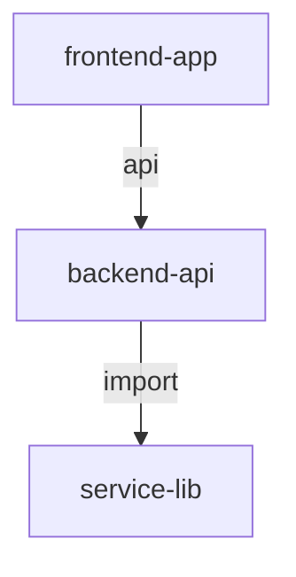

# Skill 5: Multi-Repo Intelligence

Understand relationships across multiple repositories and detect breaking changes.

## Overview

The Multi-Repo Intelligence skill provides comprehensive analysis of codebases spanning multiple repositories. It indexes repositories, maps cross-repo dependencies, visualizes relationships, and alerts on breaking changes.

## Features

- 🔍 **Repository Indexing** - Index local and GitHub repositories
- 🔗 **Dependency Mapping** - Detect import, API, shared library, and config dependencies
- 📊 **Graph Visualization** - Interactive HTML graphs and Mermaid diagrams
- 🚨 **Breaking Change Alerts** - Detect and alert on breaking changes across repos
- 🔄 **CI/CD Integration** - Automated change detection in pipelines

## Installation

```bash
cd skill5-multi-repo-intelligence
pip install -r requirements.txt
```

## Quick Start

```python
from src.indexer import RepoIndexer
from src.dependency_mapper import DependencyMapper
from src.graph import RepoGraph
from src.alerter import BreakingChangeAlerter

# Initialize indexer
indexer = RepoIndexer(github_token="your_token")

# Add repositories
indexer.add_local_repo("/path/to/repo1", "backend-api")
indexer.add_local_repo("/path/to/repo2", "frontend-app")
indexer.add_github_repo("owner/service-lib")

# Map dependencies
mapper = DependencyMapper(indexer)
deps = mapper.map_dependencies()

# Generate visualization
graph = RepoGraph(indexer, mapper)
graph.to_interactive_html("repo_graph.html")

# Set up breaking change detection
alerter = BreakingChangeAlerter(indexer, mapper)
alerter.capture_baseline()
# ... make changes ...
alerts = alerter.detect_changes()
```

## Core Components

### RepoIndexer

Indexes repositories and extracts code metadata.

```python
indexer = RepoIndexer(github_token=os.getenv("GITHUB_TOKEN"))

# Add local repo
indexer.add_local_repo("/path/to/repo", name="my-service")

# Add GitHub repo
indexer.add_github_repo("owner/repo-name")

# Add multiple repos concurrently
await indexer.add_github_repos_async(["owner/repo1", "owner/repo2"])

# Search indexed code
results = indexer.search("UserService")

# Get statistics
stats = indexer.get_stats()
```

### DependencyMapper

Maps dependencies between repositories.

```python
mapper = DependencyMapper(indexer)

# Map all dependencies
deps = mapper.map_dependencies()

# Get dependency matrix
matrix = mapper.get_dependency_matrix()

# Find circular dependencies
cycles = mapper.get_circular_dependencies()

# Impact analysis for a repo
impact = mapper.get_impact_analysis("backend-api")

# Generate markdown report
report = mapper.generate_dependency_report()
```

### RepoGraph

Visualizes repository relationships.

```python
graph = RepoGraph(indexer, mapper)

# Build the graph
graph.build_graph()

# Interactive HTML visualization
graph.to_interactive_html("output.html", height="800px")

# Mermaid diagram
mermaid = graph.to_mermaid()

# D3.js JSON
data = graph.to_d3_json()
graph.save_d3_json("graph.json")

# Graph analysis
analysis = graph.analyze_graph()
```

### BreakingChangeAlerter

Detects breaking changes across repositories.

```python
alerter = BreakingChangeAlerter(indexer, mapper)

# Capture baseline state
alerter.capture_baseline()

# After making changes, re-index and detect
indexer.add_local_repo("/path/to/repo", "backend-api")  # Re-index
alerts = alerter.detect_changes()

# Filter alerts
critical = alerter.get_alerts(severity="critical")

# Display in table
alerter.display_alerts()

# Export to GitHub issues
alerter.export_alerts_to_github_issues("owner/alerts-repo")

# Save/load baseline
alerter.save_baseline("baseline.json")
alerts.load_baseline("baseline.json")
```

## CLI Usage

```bash
# Index repositories
python -m src.indexer --local ./repo1 --local ./repo2 --github owner/repo3

# Generate dependency report
python -m src.dependency_mapper --format markdown --output report.md

# Generate graph
python -m src.graph --format html --output graph.html

# Check for breaking changes
python -m src.alerter --baseline baseline.json --check
```

## CI/CD Integration

### GitHub Actions

```yaml
name: Cross-Repo Impact Analysis

on:
  push:
    branches: [main]

jobs:
  analyze:
    runs-on: ubuntu-latest
    steps:
      - uses: actions/checkout@v3
      
      - name: Setup Python
        uses: actions/setup-python@v4
        with:
          python-version: '3.11'
      
      - name: Install dependencies
        run: pip install -r skill5-multi-repo-intelligence/requirements.txt
      
      - name: Load baseline
        run: |
          python -c "
          from src.indexer import RepoIndexer
          from src.alerter import BreakingChangeAlerter
          indexer = RepoIndexer()
          indexer.load_index('baseline.json')
          alerter = BreakingChangeAlerter(indexer)
          alerter.load_baseline('baseline.json')
          indexer.add_local_repo('.', 'current')
          alerts = alerter.detect_changes('current')
          if alerts:
              alerter.display_alerts(alerts)
              exit(1 if any(a.severity == 'critical' for a in alerts) else 0)
          "
```

## Configuration

### Environment Variables

```bash
GITHUB_TOKEN=your_github_token
REPO_CACHE_DIR=.repo_cache
BASELINE_FILE=baseline.json
```

### Dependency Types Detected

| Type | Description | Example |
|------|-------------|---------|
| `import` | Code imports between repos | `from other_repo import module` |
| `shared_lib` | Shared package/library dependencies | Both use `requests>=2.0` |
| `api` | HTTP API calls between services | `fetch('http://api.service/endpoint')` |
| `config` | Shared configuration files | Both use `logging.yaml` |

## Output Formats

### Interactive HTML Graph

Features:
- Drag and drop nodes
- Zoom and pan
- Hover for details
- Colored by language
- Edge thickness = dependency strength

### Mermaid Diagram



### D3.js JSON

```json
{
  "nodes": [
    {"id": "backend-api", "language": "python", "size": 500}
  ],
  "links": [
    {"source": "frontend-app", "target": "backend-api", "type": "api"}
  ]
}
```

## Alert Severity Levels

| Level | Description | Action Required |
|-------|-------------|-----------------|
| Critical | Breaking change affecting other repos | Immediate attention |
| High | Significant change with potential impact | Review before merge |
| Medium | Change with limited impact | Monitor |
| Low | Minor change or addition | Informational |

## Examples

See the `examples/` directory for complete working examples:

- `basic_indexing.py` - Basic repository indexing
- `dependency_analysis.py` - Full dependency analysis
- `breaking_change_detection.py` - Breaking change workflow
- `ci_integration.py` - CI/CD integration example

## Testing

```bash
pytest tests/
```

## License

MIT - RobeetsDay Project