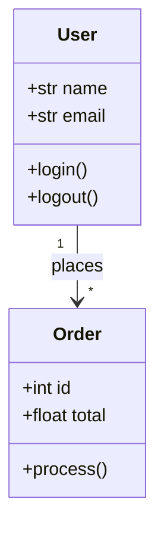
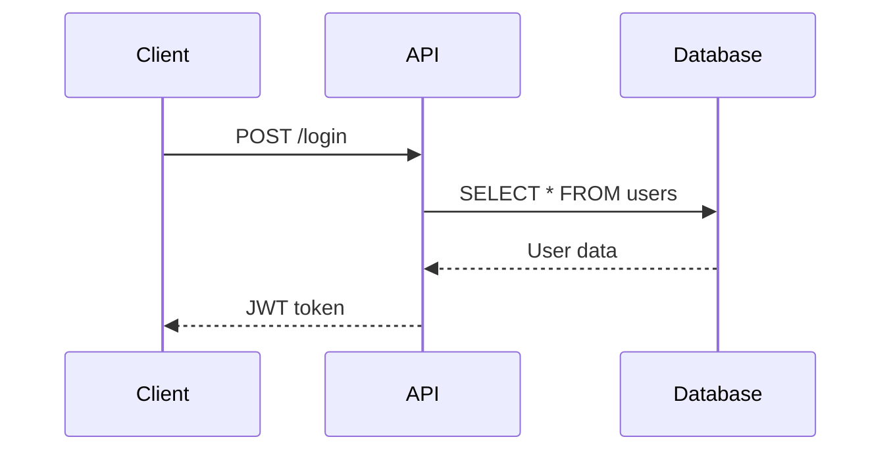
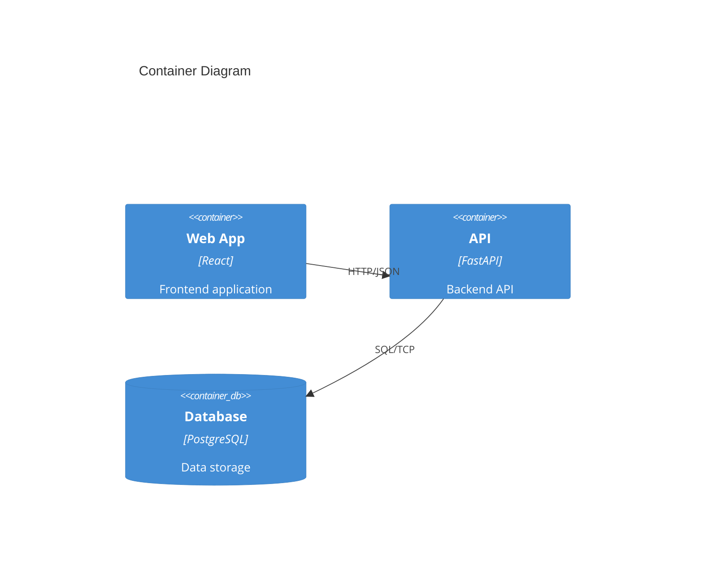

# Skill 6: Visual Architecture Generator

Creates diagrams automatically from code.

## Overview

The Visual Architecture Generator parses Python, JavaScript/TypeScript, Rust, Go, and Java code to extract class hierarchies, function relationships, and dependencies. It generates Mermaid diagrams, C4 model diagrams, and renders them to SVG, PNG, or PDF.

## Features

- 📊 **Class Diagrams** - UML class diagrams with inheritance and associations
- 🔄 **Sequence Diagrams** - Show interaction between components
- 📦 **Component Diagrams** - Module-level dependencies
- 🗄️ **ER Diagrams** - Entity-relationship from data classes
- 🏗️ **C4 Model** - Context, Container, Component, Code diagrams
- 🎨 **Multiple Formats** - SVG, PNG, PDF, HTML, Markdown

## Installation

```bash
cd skill6-visual-architecture
pip install -r requirements.txt

# For rendering diagrams, also install:
npm install -g @mermaid-js/mermaid-cli  # For mermaid diagrams
```

## Quick Start

```python
from src.parser import CodeParser
from src.mermaid_gen import MermaidGenerator, DiagramConfig
from src.c4_gen import C4Generator
from src.renderer import DiagramRenderer

# Parse code
parser = CodeParser()
parsed_files = parser.parse_directory("./src", pattern="**/*.py")

# Generate class diagram
mermaid = MermaidGenerator()
diagram = mermaid.generate_class_diagram(parsed_files, "My System")

# Render to SVG
renderer = DiagramRenderer()
renderer.render(diagram, "diagram.svg")

# Generate C4 diagrams
c4 = C4Generator()
c4.analyze_codebase(parsed_files, "My System")
c4.generate_all_levels("./output/")
```

## Core Components

### CodeParser

Parses code files to extract architectural information.

```python
from src.parser import CodeParser

parser = CodeParser()

# Parse single file
parsed = parser.parse_file("path/to/file.py")

# Parse entire directory
parsed_files = parser.parse_directory("./src", pattern="**/*.py")

# Access parsed data
for pf in parsed_files:
    print(f"File: {pf.path}")
    for cls in pf.classes:
        print(f"  Class: {cls.name}")
        for method in cls.methods:
            print(f"    Method: {method.name}")
```

### MermaidGenerator

Generates Mermaid diagram syntax.

```python
from src.mermaid_gen import MermaidGenerator, DiagramConfig

config = DiagramConfig(
    direction="TD",
    theme="dark",
    show_private=False,
    show_methods=True,
    max_classes=50
)

generator = MermaidGenerator(config)

# Class diagram
class_diagram = generator.generate_class_diagram(parsed_files, "System Architecture")

# Sequence diagram
sequence = generator.generate_sequence_diagram(
    parsed_files, 
    entry_point="main",
    max_depth=5,
    title="Login Flow"
)

# Component diagram
component = generator.generate_component_diagram(parsed_files)

# ER diagram
er = generator.generate_er_diagram(parsed_files)

# Save
generator.save_diagram(class_diagram, "class_diagram.mmd")
```

### C4Generator

Generates C4 Model diagrams.

```python
from src.c4_gen import C4Generator

c4 = C4Generator()

# Analyze codebase
c4.analyze_codebase(parsed_files, "My Application")

# Generate all levels
context = c4.generate_context_diagram("System Context")
container = c4.generate_container_diagram()
component = c4.generate_component_diagram("api_service")

# Generate all diagrams at once
c4.generate_all_levels("./output/")

# Convert to PlantUML
plantuml = c4.to_plantuml()
```

### DiagramRenderer

Renders diagrams to various output formats.

```python
from src.renderer import DiagramRenderer, RenderConfig

config = RenderConfig(
    format="svg",
    width=1200,
    height=800,
    theme="dark"
)

renderer = DiagramRenderer(config)

# Render single diagram
renderer.render(diagram_content, "output.svg", diagram_type="mermaid")

# Render multiple to HTML
diagrams = {
    "Class Diagram": class_diagram,
    "Sequence": sequence_diagram,
    "Components": component_diagram
}
renderer.render_to_html(diagrams, "index.html", "Architecture")

# Render to PDF
renderer.render_to_pdf(diagrams, "architecture.pdf")

# Batch render
results = renderer.batch_render(
    diagrams,
    output_dir="./output",
    formats=['svg', 'png', 'pdf']
)

# Watch for changes
renderer.watch_and_render("./src", "./output")
```

## CLI Usage

```bash
# Parse and generate class diagram
python -m src.parser --input ./src --output parsed.json

# Generate diagrams
python -m src.mermaid_gen --input parsed.json --type class --output diagram.mmd

# Render diagram
python -m src.renderer --input diagram.mmd --format svg --output diagram.svg

# Full pipeline
python -m src.cli --input ./src --output ./docs --formats svg,png,html
```

## Diagram Types

### Class Diagram



### Sequence Diagram



### C4 Container Diagram



## Supported Languages

| Language | Parsing Method | Features |
|----------|---------------|----------|
| Python | tree-sitter | Classes, functions, imports, decorators |
| JavaScript | tree-sitter | Classes, functions, imports, exports |
| TypeScript | tree-sitter | Classes, interfaces, types, generics |
| Rust | tree-sitter | Structs, enums, traits, functions |
| Go | regex fallback | Functions, structs |
| Java | regex fallback | Classes, interfaces, methods |

## Output Formats

| Format | Description | Requires |
|--------|-------------|----------|
| MMD | Mermaid source | None |
| MD | Markdown with mermaid | None |
| SVG | Scalable vector graphic | mmdc |
| PNG | Raster image | mmdc |
| PDF | Document | ReportLab |
| HTML | Interactive page | None |
| PUML | PlantUML source | None |

## CI/CD Integration

### GitHub Actions

```yaml
name: Generate Architecture Docs

on:
  push:
    branches: [main]
    paths:
      - 'src/**'

jobs:
  diagrams:
    runs-on: ubuntu-latest
    steps:
      - uses: actions/checkout@v3
      
      - name: Setup Python
        uses: actions/setup-python@v4
        with:
          python-version: '3.11'
      
      - name: Install dependencies
        run: |
          pip install -r skill6-visual-architecture/requirements.txt
          npm install -g @mermaid-js/mermaid-cli
      
      - name: Generate diagrams
        run: |
          python -c "
          from src.parser import CodeParser
          from src.mermaid_gen import MermaidGenerator
          from src.renderer import DiagramRenderer
          
          parser = CodeParser()
          files = parser.parse_directory('./src')
          
          mermaid = MermaidGenerator()
          renderer = DiagramRenderer()
          
          diagrams = {
              'classes': mermaid.generate_class_diagram(files),
              'components': mermaid.generate_component_diagram(files)
          }
          
          renderer.batch_render(diagrams, './docs/architecture', ['svg', 'png'])
          renderer.render_to_html(diagrams, './docs/architecture/index.html')
          "
      
      - name: Deploy to GitHub Pages
        uses: peaceiris/actions-gh-pages@v3
        with:
          github_token: ${{ secrets.GITHUB_TOKEN }}
          publish_dir: ./docs/architecture
```

## Configuration

### DiagramConfig

```python
from src.mermaid_gen import DiagramConfig

config = DiagramConfig(
    direction="TD",           # TD, LR, RL, BT
    theme="dark",             # default, dark, forest, neutral
    show_private=False,       # Include private members
    show_methods=True,        # Include methods
    show_attributes=True,     # Include attributes
    max_classes=50,           # Limit classes
    max_methods_per_class=10  # Limit methods per class
)
```

### RenderConfig

```python
from src.renderer import RenderConfig

config = RenderConfig(
    format="svg",
    width=1200,
    height=800,
    theme="dark",
    background="white",
    scale=1.0
)
```

## Examples

See the `examples/` directory:

- `generate_class_diagram.py` - Generate class diagram from Python project
- `generate_c4_model.py` - Full C4 model generation
- `ci_pipeline.py` - CI/CD integration example
- `watch_mode.py` - Live diagram updates

## Tips

1. **Large Codebases**: Use `max_classes` to limit diagram size
2. **Private Members**: Set `show_private=True` for complete diagrams
3. **Custom Styling**: Modify the theme in RenderConfig
4. **Incremental Updates**: Use watch mode during development

## Testing

```bash
pytest tests/
```

## License

MIT - RobeetsDay Project